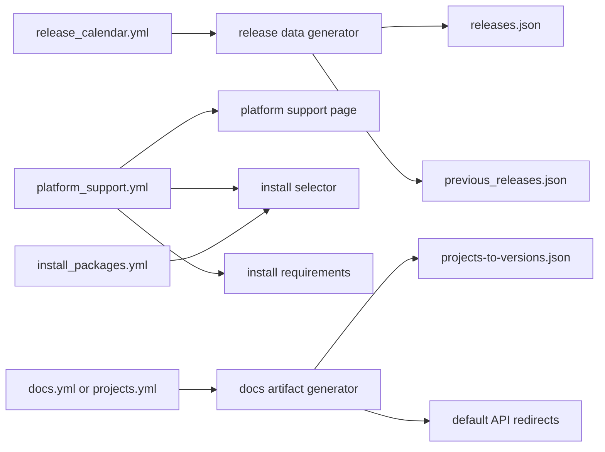

# Automation and Single-Source Proposal

Date: 2026-06-30

## Scope and method

This analysis covers the 50 most recently created pull requests in
`rapidsai/docs`, from [#749](https://github.com/rapidsai/docs/pull/749) through
[#802](https://github.com/rapidsai/docs/pull/802), created between 2026-02-12
and 2026-06-30. At the time of analysis, 46 were merged, 2 were open, and 2
were closed.

Every PR was inspected at the metadata and changed-file level. Recurring
groups were then traced through their current source files, generators,
workflows, Jekyll consumers, and representative diffs. The recommendations
below distinguish canonical policy data from generated projections and from
human-authored prose.

## Executive summary

There are four strong opportunities beyond the platform-support-to-selector
work in #802:

1. Make one release calendar authoritative and generate the active channel
   map, historical schedule, durations, and release rollover diff from it.
2. Render the installation page's current system requirements directly from
   platform support data.
3. Make the docs project catalog authoritative for the generated
   project-to-version map and default API redirects, including cuDF-Java's
   delayed publication workflow.
4. Move installable package names, aliases, dependencies, channel
   availability, and PyPI availability into a small install-package catalog.

The first three address observed mistakes or drift. The fourth removes a
substantial amount of release-specific branching from `selector.html` and
makes future project onboarding less invasive.

The desired end state is several focused sources of truth, not one oversized
YAML file:



Generated outputs should never be edited directly. Each generator should be
deterministic, idempotent, and available in both `--check` mode and pre-commit.

## Evidence from the PR sample

The following hotspot counts overlap because a release rollover can touch
multiple systems.

| Hotspot | PRs out of 50 | Evidence |
| --- | ---: | --- |
| Install selector | 10 | #754, #757, #769, #771, #775, #779, #780, #790, #797, #802 |
| Dependency lockfile | 9 | All nine were Dependabot updates and are already automated |
| Release/platform data | 7 | #758, #768, #772, #780, #790, #798, #801 |
| Docs catalog or generated version map | 6 | #753, #755, #768, #777, #790, #793 |
| Notices | 4 | #762, #763, #773, #786 |

Two release rollovers were especially expensive:

- [#768](https://github.com/rapidsai/docs/pull/768) changed 5 files with
  187 additions and 101 deletions.
- [#790](https://github.com/rapidsai/docs/pull/790) changed 6 files with
  190 additions and 106 deletions.

The latter also accidentally restored an obsolete staggered-burndown rule.
[#798](https://github.com/rapidsai/docs/pull/798) corrected that regression.
This is a strong signal that rollover should be a data transformation rather
than a copied and hand-edited block.

## 1. Canonical release calendar and rollover automation

Priority: P0

### Current state

Release identity and schedule data are split between:

- `_data/releases.json`, an 80-line channel-oriented view;
- `_data/previous_releases.json`, a 1,499-line history-oriented view;
- hardcoded phase labels and project cohorts in `maintainers/index.md` and
  `releases/schedule.md`;
- the manual steps in `release_checklist.md`.

At rollover, the nightly schedule is copied into history, four aliases are
shifted, a new proposed schedule is added, platform support is added, project
availability is reviewed, and generated docs mappings are refreshed. The same
schedule record therefore exists in different shapes at different times.

Durations are also stored independently from their start and end dates.
[#772](https://github.com/rapidsai/docs/pull/772) fixed an off-by-one date and
duration. The description of #798 explicitly calls the `days` values manual
and inconsistent. A local weekday-only recomputation also disagrees with many
current values. Some differences may intentionally account for holidays or
NVIDIA free days, but those exclusions are not encoded, so the values are not
auditable. For example:

- 26.08 `cudf_burndown` is July 16-22, five weekdays, but declares six days.
- 26.10 `other_codefreeze` is October 1-6, four weekdays, but declares five
  days.

Date formats are inconsistent as well (`Jul 15 2026` and `July 15 2026`).

### Proposed source

Add `_data/release_calendar.yml` with channel pointers and version-keyed
records:

```yaml
channels:
  legacy: "26.04"
  stable: "26.06"
  nightly: "26.08"
  next_nightly: "26.10"

cohorts:
  early:
    - cudf
    - rmm
    - rapids-cmake
    - raft
    - dask-cuda
    - kvikio
    - ucxx
    - rapidsmpf
    - nvforest

releases:
  "26.08":
    ucxx_version: "0.51"
    phases:
      development:
        start: 2026-05-14
        end: 2026-07-15
      early_burndown:
        start: 2026-07-16
        end: 2026-07-22
      release:
        start: 2026-08-05
        end: 2026-08-06
```

Use ISO dates in the canonical file. Rename `cudf_*` phases to cohort-based
names so adding a project such as nvForest does not require changing four
rendered labels as it did in
[#799](https://github.com/rapidsai/docs/pull/799).

### Automation

Create `ci/generate-release-data.py` to produce the existing
`_data/releases.json` and `_data/previous_releases.json` shapes initially. This
keeps current Liquid consumers stable while removing duplicate authoring.

Create `ci/roll-release.py` to:

1. validate that the new stable release has platform support data;
2. rotate the four channel pointers;
3. create the next release key and expected version number;
4. regenerate release projections and docs mappings;
5. print a concise list of policy decisions that still need human input.

The script should not invent support policy or project availability. It should
fail with a clear checklist when required source records are absent.

For durations, choose one explicit policy:

- remove the duration column and stop storing `days`; or
- derive it from weekdays plus a checked-in exclusion calendar.

Keeping hand-authored `days` alongside dates should not remain an option.

### Validation

The generator or a companion validator should enforce:

- channel pointers reference existing, distinct releases in order;
- phases are ordered, non-overlapping, and contiguous where required;
- release versions and UCXX versions are unique and monotonic;
- stable and nightly releases exist in `platform_support.yml`;
- generated files exactly match canonical input;
- cohort names referenced by schedules exist.

## 2. Render current install requirements from platform support

Priority: P0

### Current state

`install/index.md` says its system requirements are for the current release,
but independently hardcodes:

- glibc 2.28;
- Volta / compute capability 7.0;
- CUDA 12 and CUDA 13;
- driver minima 525.60.13 (incorrect; it should be 535) and 580.65.06.

Most of that data also exists in `_data/platform_support.yml`. This page can
drift even after #802 makes the selector data-driven.

The current stable platform record correctly uses `driver_min: "535"` for
CUDA 12, while the install page incorrectly says `525.60.13`. This is existing
drift: the install page should use the platform record's 535 minimum.

### Proposal

Have `install/index.md` select the stable release record and render:

- glibc minimum;
- each CUDA major and its `driver_min` value;
- minimum compute capability per CUDA major;
- a link to the full tested OS matrix.

Keep the broad distro examples as prose because they are examples inferred
from glibc compatibility, not the tested OS list.

Also validate that `releases.json` stable/nightly pointers resolve to exactly
one platform record. #802 already introduces most of that validation.

## 3. Make the docs project catalog authoritative

Priority: P1

### Current state

`_data/docs.yml` is already close to a canonical project catalog, and
`ci/generate-projects-to-versions.py` generates
`ci/customization/projects-to-versions.json`. However, the generated JSON is
tracked and is still edited directly by
`.github/workflows/deploy-cudf-java-docs.yaml` with `jq`.

This caused the workflow fix in
[#752](https://github.com/rapidsai/docs/pull/752), and cuDF-Java availability
then changed again in #753, #777, and #793. The workflow currently edits the
YAML with `sed` and the generated JSON separately instead of invoking the
existing generator.

Project onboarding is similarly distributed. Adding nvForest API docs in
[#755](https://github.com/rapidsai/docs/pull/755) required changes to:

- `_data/docs.yml`;
- `_redirects`;
- `ci/customization/projects-to-versions.json`.

A catalog-to-redirect comparison found that cuVS is currently the only active,
stable-enabled API entry without a root redirect. If that is intentional, the
catalog should say so explicitly. The redirect file also contains temporary
cuML redirects marked removable after 25.10 even though stable is now 26.06.

Finally, UCXX version selection is special-cased twice:

- Python checks whether `"ucxx"` appears in a project key;
- Liquid checks whether the display name equals `libucxx` or `UCXX`.

### Proposal

Keep `_data/docs.yml` or rename it to `_data/projects.yml`, but make every
exception declarative. Add fields such as:

```yaml
ucxx:
  name: UCXX
  release_version_field: ucxx_version
  redirect:
    mode: stable

librmm:
  redirect:
    target: /api/rmm/stable/
```

Generate or validate all derived artifacts:

- `projects-to-versions.json`;
- the regular `/api/<path>` and `/api/<path>/` redirects;
- version labels in `api-docs.html` through `release_version_field`;
- optional redirect expiry warnings.

The cuDF-Java workflow should update only catalog source data with a YAML
parser, then run the normal generator. Its `new_stable_value` input is
currently required, defaults to `1`, and rejects every value except `1`; it can
be removed. The supplied version should be checked against the current stable
release or stored as an explicit catalog override if delayed publication needs
that flexibility.

Longer term, generate `projects-to-versions.json` during deploy and stop
tracking it. A lower-risk first step is to keep tracking it but make CI fail if
it was edited directly or is stale.

## 4. Add a canonical install-package catalog

Priority: P1

### Current state

Even after #802, `_includes/selector.html` owns several overlapping package
declarations:

- Conda-selectable RAPIDS packages;
- pip-selectable packages;
- packages included in the standard metapackage/image;
- PyPI-available packages;
- display-name-to-package-name mappings;
- stable/nightly dependency differences;
- third-party CUDA constraints.

The nvForest lifecycle demonstrates the maintenance cost. #754 added 33 lines
of selector branching to make it nightly-only. #769 removed most of that logic
one release later and separately added PyPI availability.

### Proposal

Create `_data/install_packages.yml` as an install-specific source that can
reference project IDs from the docs catalog without forcing both domains into
one file:

```yaml
packages:
  nvforest:
    display_name: nvForest
    docs_project: nvforest
    added_in_release: "26.04"
    standard_bundle: false
    conda:
      packages: [nvforest]
    pip:
      packages: [nvforest]
      pypi: true

  cuxfilter:
    display_name: cuxfilter
    docs_project: cuxfilter
    removed_after_release: "26.06"
    conda:
      packages: [cuxfilter]
    pip:
      packages: [cuxfilter]

  raft:
    display_name: RAFT
    conda:
      packages: [pylibraft, raft-dask]
    pip:
      packages: [pylibraft, raft-dask]
```

The schema should support method-specific aliases, dependencies, release
bounds, standard-bundle membership, and CUDA-major constraints. Treat
`added_in_release` as the first included release and `removed_after_release` as
the last included release. With `removed_after_release: "26.06"`, cuxfilter is
automatically excluded from 26.08 and later. The validator should compare
parsed RAPIDS versions and require
`added_in_release <= removed_after_release` when both are present. Jekyll can
serialize this data into Alpine just as #802 does for platform support.

Do not try to infer package policy from the docs catalog. A project can have
API docs without being a selector package, and one project can publish several
packages. References between the catalogs are useful; conflating them is not.

## 5. Add schema and rendered-output guardrails

Priority: P1, low effort

These checks do not replace the canonical-source work, but they prevent the
same classes of mistakes during migration.

### Release validation

Add a pre-commit/CI validator for release schema, ISO dates, phase continuity,
channel ordering, and generated-file freshness. This should land before the
calendar migration so it can characterize existing exceptions.

### Notice validation and scaffolding

[#762](https://github.com/rapidsai/docs/pull/762) fixed a 2025/2026 front-matter
typo that changed notice sort order. All 93 current notices pass a local check
for filename/type/ID consistency, status-color pairs, and updated-date ordering.
Preserve that state with `ci/validate-notices.py`.

An optional `ci/new-notice.py --type rsn` can allocate the next ID and create
valid front matter, while leaving all prose human-authored.

### PR site build

`.github/workflows/pr.yaml` currently runs pre-commit only. Add at least:

- `bundle exec jekyll build`;
- generated-data `--check` commands;
- a small rendered selector test for release labels and generated commands.

This catches valid YAML/Liquid/JavaScript combinations that static formatting
hooks cannot. It also removes dependence on contributors having Ruby locally.

### Redirect validation

Require every stable-enabled project to declare a generated redirect, an
explicit custom target, or an opt-out. Allow temporary redirects to carry an
`expires_after` release and emit a warning or failure after that release.

## Recommended implementation sequence

1. Add non-mutating validators and a PR Jekyll build.
2. Introduce the canonical release calendar and deterministic projections.
3. Add the rollover command and optional workflow-dispatch PR creator.
4. Extend platform support schema and render `install/index.md` requirements.
5. Normalize docs catalog exceptions, redirects, and the cuDF-Java workflow.
6. Move selector package policy into `install_packages.yml`.

Each step should be a separate PR. In particular, do not combine the release
calendar migration with package-catalog work; both touch release behavior but
have different owners and failure modes.

## What should remain human-authored

- Platform support decisions such as adding an OS, CUDA toolkit, or GPU family.
- Release dates and company-specific non-working days.
- Whether a project belongs in the standard RAPIDS package or image.
- Notice prose, migration guidance, and lifecycle decisions.

Automation should validate and propagate those decisions, not discover policy
by scraping repositories, package indexes, or S3. External availability can be
used as a check, but should not silently change the published docs.

## Existing automation to preserve

- Dependabot produced 9 of the 50 PRs and is already handling lockfile churn.
- pre-commit.ci produced the pre-commit autoupdate PR.
- `generate-projects-to-versions.py` is the right pattern; the remaining work
  is to make every caller use it and to stop direct edits to its output.
- The cuDF-Java workflow already creates a PR after upload; it should be
  simplified, not replaced.

## PR inventory

This partition accounts for all 50 reviewed PRs exactly once.

| Primary category | Count | PRs |
| --- | ---: | --- |
| Existing dependency/tool update automation | 10 | #750, #759, #760, #764, #766, #774, #778, #794, #795, #796 |
| Release, platform, or selector maintenance | 16 | #754, #757, #758, #768, #769, #771, #772, #775, #779, #780, #790, #797, #798, #799, #801, #802 |
| API docs catalog or deployment | 5 | #752, #753, #755, #777, #793 |
| Notices | 4 | #762, #763, #773, #786 |
| CI or site infrastructure | 5 | #765, #767, #776, #788, #800 |
| Documentation content or cleanup | 10 | #749, #756, #761, #770, #781, #782, #783, #784, #785, #791 |

## Success criteria

The automation program is successful when:

- a release rollover starts from one canonical calendar edit and produces a
  deterministic, reviewable diff;
- no duration can disagree with its dates without an explicit calendar rule;
- current install requirements, platform support, and selector options share
  the same support record;
- adding a docs project requires one catalog record plus intentional overrides;
- generated JSON and regular redirects are never edited directly;
- adding, graduating, or removing a selector package is primarily a data
  change;
- PR CI renders the site and rejects stale generated artifacts.
